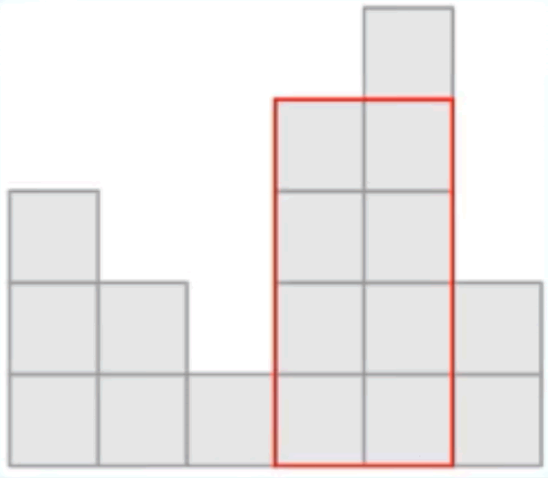

## 最大的矩形纸片

### 题目描述

一张半边参差不齐的网格纸 (网格边长均为1)，有一边是完整没有破损的。现要从中剪出一片面积最大的矩形纸片。

给定网格纸中完整边的长度$N$，以及网格中每一列残存部分的高度$N_i$，输出能够剪出的最大矩形纸片面积。

例如: $N=6$，每一列残存部分的高度依次为3、2、1、4、5、2，如下图所示：



可以发现，沿着红色框可以剪出的矩形纸片面积最大，为8，所以输出8。

### 输入格式

第一行输入一个正整数$N$，表示纸片完整边的长度

第二行输入$N$个正整数，表示每列格子残存部分的高度，两个正整数之间用一个空格隔开

### 输出格式

输出一个正整数，表示能够剪出的最大矩形纸片面积

### 样例

#### 样例输入

```
6
3 2 1 4 5 2
```

#### 样例输出

```
8
```

### 提示

 $1 \le N \le 1000000$

 $1 \le N_i \le10000$
